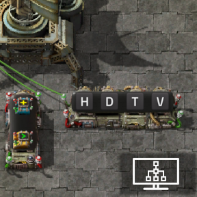
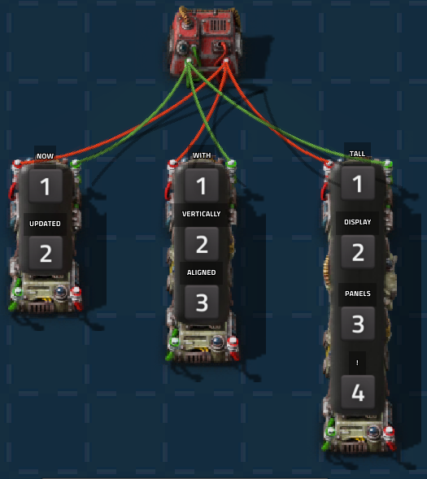

# Widescreen Display Panels

  
 

Adds 2x1, 3x1, and 4x1 widescreen and tallscreen variants of the vanilla display panel, designed for cleaner dashboards and improved readability/organisation in circuit network setups.

  
 

## Features

- Three new panel sizes in two orientations:

  - 2x1 widescreen display panel
  - 3x1 widescreen display panel
  - 4x1 widescreen display panel
  - 1x2 tallscreen display panel
  - 1x3 tallscreen display panel
  - 1x4 tallscreen display panel

- Fully compatible with circuit networks

- Native-style rendering and behaviour

- Per-segment rule system with:

  - Multiple rules per segment
  - Signal-based conditions
  - Custom messages and icons
  - Optional alt-mode visibility
  - Optional chart tag display

- Copy and paste segment configurations between panels

## Integration

- Fully integrated with Display Signal Counts mod

## Usage

Each panel is divided into segments depending on its length. Each segment behaves as a single vanilla panel:

- Evaluates rules in order
- Displays the first matching rule
- Can show an icon and/or message
- Can optionally display in alt-mode
- Can optionally create a chart tag

### Wiring

- The **top** and **left side** of the panel functions as the circuit input on the **vertical** and **horizontal screens** respectively.
- Likewise the **bottom** and **right side** uses an invisible connector that outputs the merged signals

This allows panels to act as both display and passthrough components in circuit networks. 

### Copy and Paste

Segments can be copied and pasted:

- Copy a configured segment
- Paste onto another segment or panel

## Unlocking

All widescreen panels are unlocked alongside the vanilla display panel via circuit network research. 
They use the vanilla panel recipe multiplied by the panel's length.

## Notes

- Panels are fixed to north-facing orientation
- Behaviour is intentionally aligned with vanilla display panels where possible

## Compatibility

- Factorio 2.0+
- Space age compatible (not required)
- Compatible with most mods that interact with display panels or circuit networks

## Known limitations

- No direct copy/paste from vanilla display panels
- Panels are fixed orientation (no flipping/rotating)

## Future plans

- Additional quality-of-life improvements/tweaks

## Latest Version

[1.1.0 Tallscreen Update](https://github.com/lyttelgeek/WidescreenDisplayPanels/releases/tag/1.1.0-Tallscreen_Update) 

