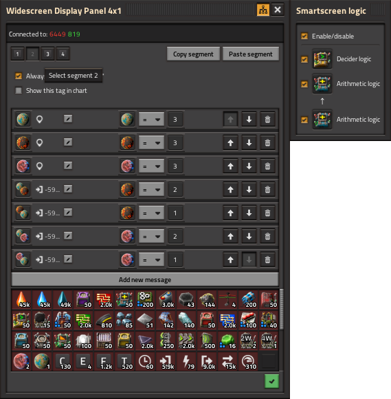

# Widescreen Display Panels

Adds 2x1, 3x1, and 4x1 widescreen and tallscreen variants of the vanilla display panel, designed for cleaner dashboards and improved readability/organisation in circuit network setups.

## Features

- Three new panel sizes in two orientations:

  - 2x1 widescreen display panel
  - 3x1 widescreen display panel
  - 4x1 widescreen display panel
  - 1x2 tallscreen display panel
  - 1x3 tallscreen display panel
  - 1x4 tallscreen display panel

- Fully compatible with circuit networks

- Native-style rendering and behaviour

- Per-segment rule system with:

  - Multiple rules per segment
  - Signal-based conditions
  - Custom messages and icons
  - Optional alt-mode visibility
  - Optional chart tag display

- Smart logic per segment (arithmetic and decider combinators)

- Copy and paste segment configurations between panels

## Integration

- Fully integrated with Display Signal Counts mod

## Usage

Each panel is divided into horizontal/vertical segments depending on its length. Each segment behaves as a single vanilla panel:

- Evaluates rules in order
- Displays the first matching rule
- Can show an icon and/or message
- Can optionally display in alt-mode
- Can optionally create a chart tag

## Wiring

- The **top** and **left side** of the panel functions as the circuit input on the **vertical** and **horizontal** screens respectively.
- Likewise the **bottom** and **right side** uses an invisible connector that outputs the merged signals

This allows panels to act as both display and passthrough components in circuit networks.

## Smart Logic

Each segment has an optional smart logic system, accessible via the segment GUI. This allows signals to be transformed by combinators before being evaluated against display rules.

**Signal flow:** panel input → Arithmetic A → Arithmetic B → display rules

- **Arithmetic B**: enables the arithmetic combinator stage. When checked, signals pass through the arithmetic combinator before reaching the segment's display rules.
- **Arithmetic A**: unlocked when Arithmetic B is enabled. Provides an upstream pre-processing stage; its output feeds into Arithmetic B.
- **Decider**: independent of the arithmetic pipeline. Its output merges with the Arithmetic B result, with the decider winning on signal collision.

Clicking the combinator icon button opens the native Factorio combinator GUI for full configuration. Combinator configuration is preserved when toggling on/off; only the master toggle destroys combinators.

## Copy and Paste

Segments and panels can be copied and pasted:

- Copy a configured segment
- Paste onto another segment/panel
- Copy a configured full panel
- Paste onto another panel (extra segments discarded/ignored)

## Recipes

All panels require raw combinator ingredients in addition to the base display panel ingredients.

| Panel | Iron plate | Electronic circuit | Copper wire |
|-------|------------|-------------------|-------------|
| 2×1 / 1×2 | 2 | 32 | 30 |
| 3×1 / 1×3 | 3 | 48 | 45 |
| 4×1 / 1×4 | 4 | 64 | 60 |

## Unlocking

All widescreen panels are unlocked alongside the vanilla display panel via circuit network research.

## Notes

- Panels are fixed to north-facing orientation
- Behaviour is intentionally aligned with vanilla display panels where possible

## Compatibility

- Factorio 2.0+
- Space age compatible (not required)
- Compatible with most mods that interact with display panels or circuit networks

## Known limitations

- No direct copy/paste from vanilla display panels
- Panels are fixed orientation (no flipping/rotating)

## Current Version

[1.2.0 - Smartscreen Update](https://github.com/lyttelgeek/WidescreenDisplayPanels/releases/tag/1.2.0-Smartscreen_Update)
